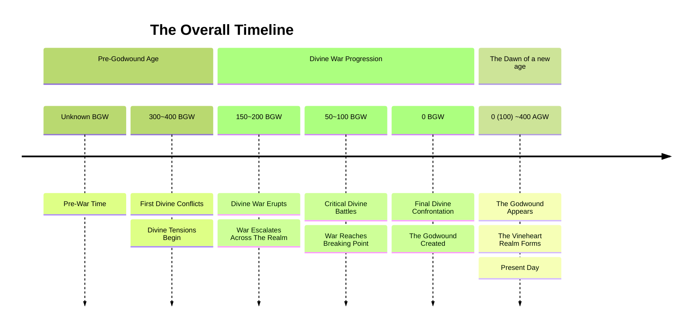
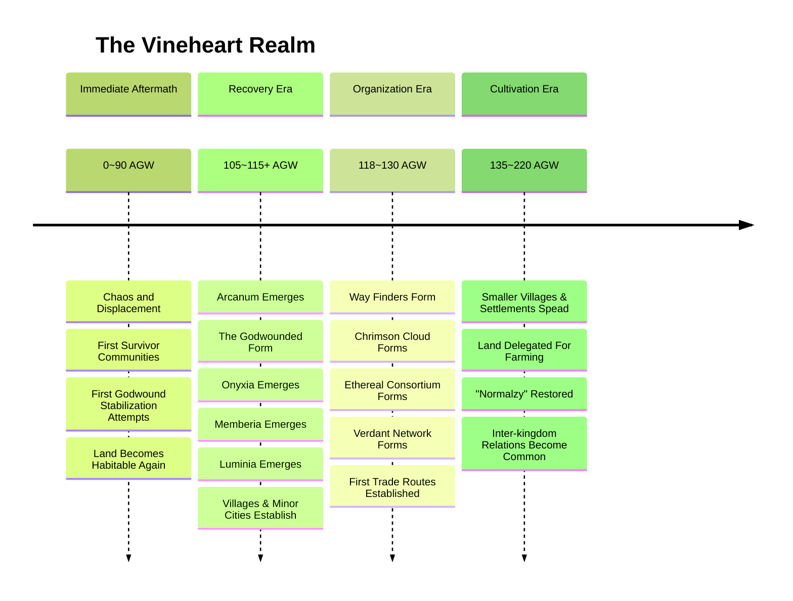
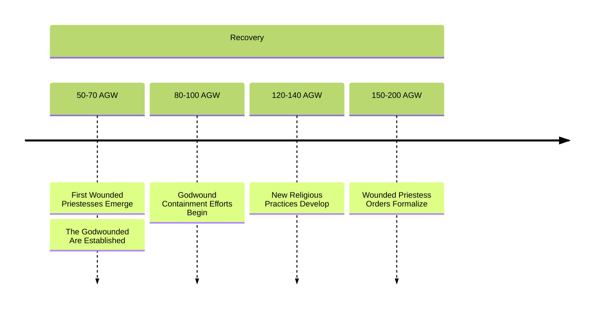
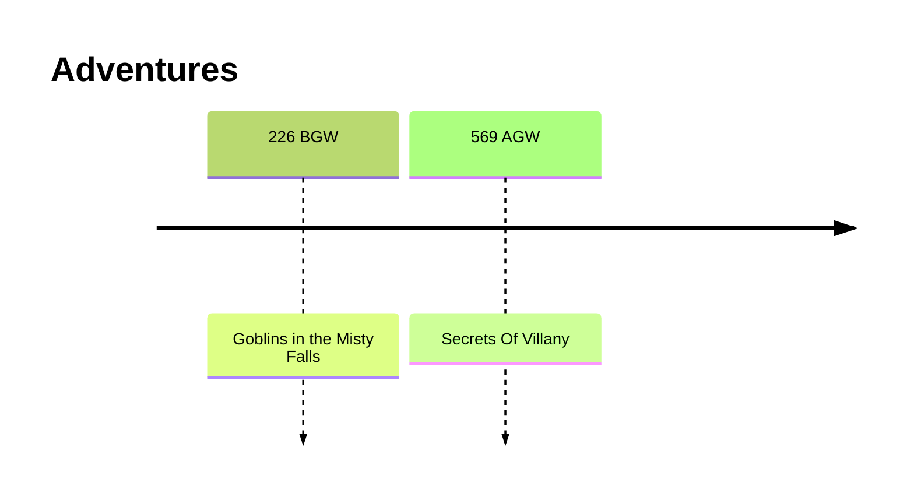

# Overall

```mermaid
%%{init: {'theme':'forest'}}%%
timeline
	title The Overall Timeline
	section Pre-Godwound Age
		Unknown BGW : Pre-War Time
		300~400 BGW : First Divine Conflicts : Divine Tensions Begin
	section Divine War Progression
		150~200 BGW : Divine War Erupts : War Escalates Across The Realm
		50~100 BGW : Critical Divine Battles : War Reaches Breaking Point
		0 BGW    : Final Divine Confrontation : The Godwound Created
	section The Dawn of a new age
		0 (100) ~400 AGW : The Godwound Appears : The Vineheart Realm Forms : Present Day
```

## The New Age

```mermaid
%%{init: {'theme':'forest'}}%%
timeline
    title The Vineheart Realm
	section Immediate Aftermath
		0~90 AGW   : Chaos and Displacement : First Survivor Communities : First Godwound Stabilization Attempts : Land Becomes Habitable Again
	section Recovery Era
		105~115+ AGW : Arcanum Emerges : The Godwounded Form : Onyxia Emerges : Memberia Emerges : Luminia Emerges : Villages & Minor Cities Establish
	section Organization Era
		118~130 AGW : Way Finders Form : Chrimson Cloud Forms : Ethereal Consortium Forms : Verdant Network Forms : First Trade Routes Established
	section Cultivation Era
		135~220 AGW : Smaller Villages & Settlements Spead : Land Delegated For Farming : "Normalzy" Restored : Inter-kingdom Relations Become Common
		 
```

## The Godwounded

```mermaid
%%{init: {'theme':'forest'}}%%
timeline
    title 
	section Recovery
	    50-70 AGW   : First Wounded Priestesses Emerge : The Godwounded Are Established
	    80-100 AGW  : Godwound Containment Efforts Begin
	    120-140 AGW : New Religious Practices Develop
	    150-200 AGW : Wounded Priestess Orders Formalize
```

## Sessions

```mermaid
%%{init: {'theme':'forest'}}%%
timeline
    title Adventures

	226 BGW : Goblins in the Misty Falls
    569 AGW : Secrets Of Villany
```

# Impacts

![[Dawn of The New Age#Calendar]]