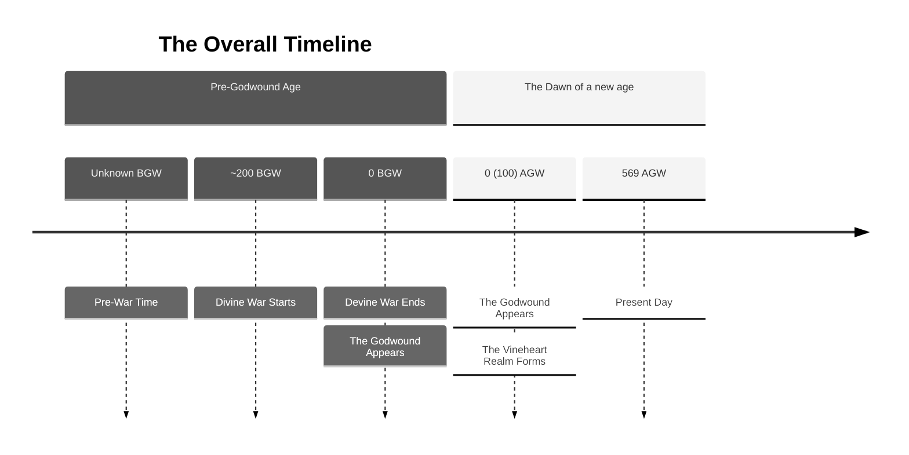
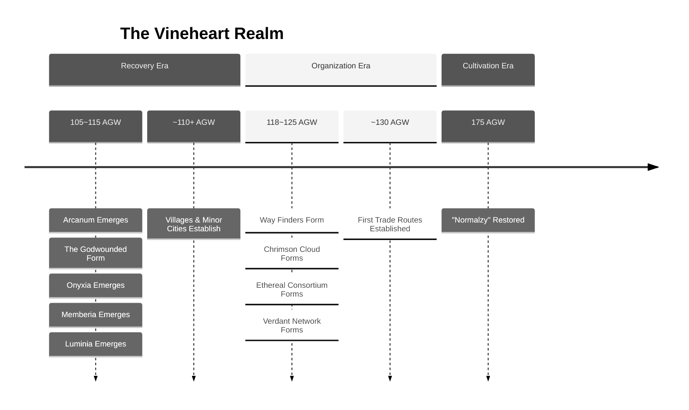
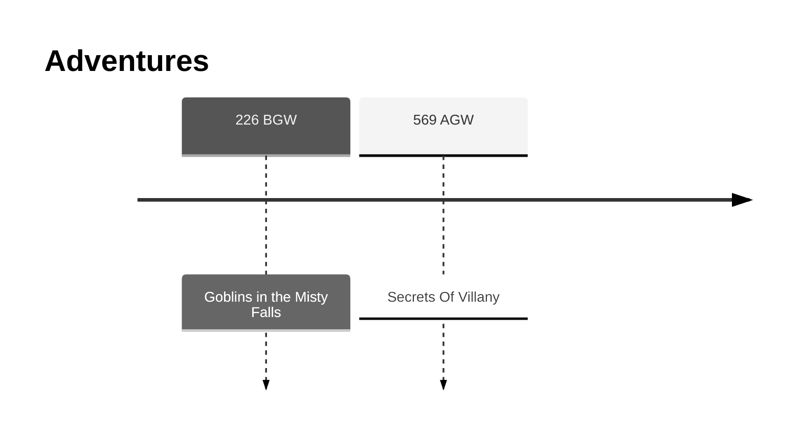

# Overall

```mermaid
%%{init: {'theme':'neutral'}}%%
timeline
	title The Overall Timeline
	section Pre-Godwound Age
		Unknown BGW : Pre-War Time
		~200 BGW    : Divine War Starts
		0 BGW       : Devine War Ends : The Godwound Appears
	section The Dawn of a new age
		0 (100) AGW : The Godwound Appears : The Vineheart Realm Forms
		569 AGW     : Present Day
```

## The New Age

```mermaid
%%{init: {'theme':'neutral'}}%%
timeline
    title The Vineheart Realm
	section Recovery Era
		105~115 AGW : Arcanum Emerges : The Godwounded Form : Onyxia Emerges : Memberia Emerges : Luminia Emerges
		~110+ AGW   : Villages & Minor Cities Establish
	section Organization Era
		118~125 AGW : Way Finders Form : Chrimson Cloud Forms : Ethereal Consortium Forms : Verdant Network Forms
		~130 AGW    : First Trade Routes Established
	section Cultivation Era
		 175 AGW : "Normalzy" Restored
```

## Sessions

```mermaid
%%{init: {'theme':'neutral'}}%%
timeline
    title Adventures

	226 BGW : Goblins in the Misty Falls
    569 AGW : Secrets Of Villany
```

# Impacts

![[Dawn of The New Age#Calendar]]